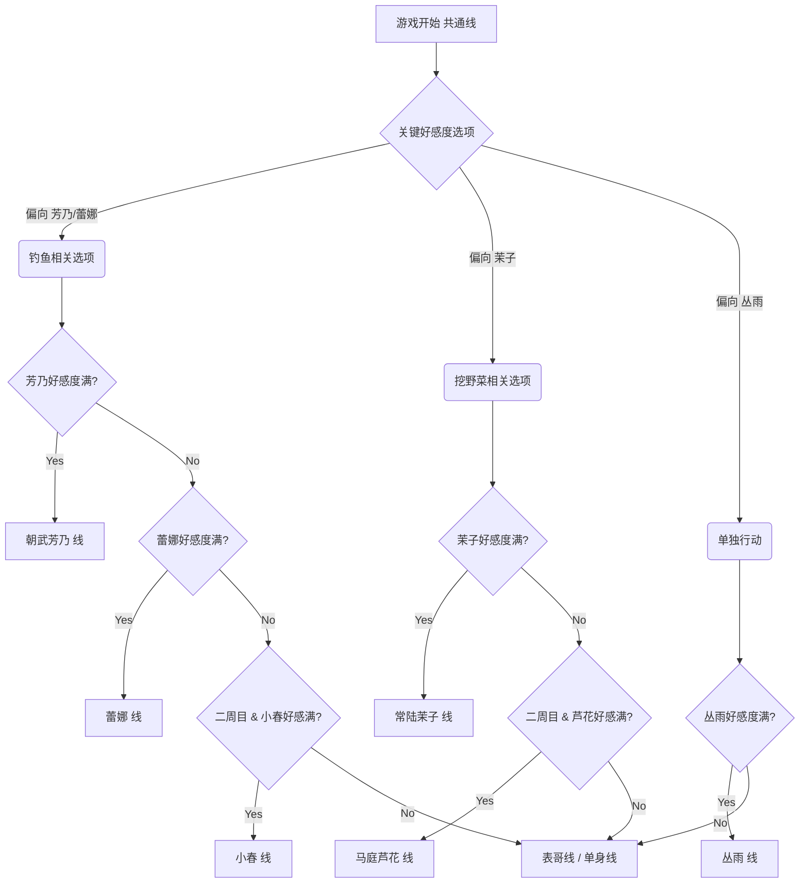
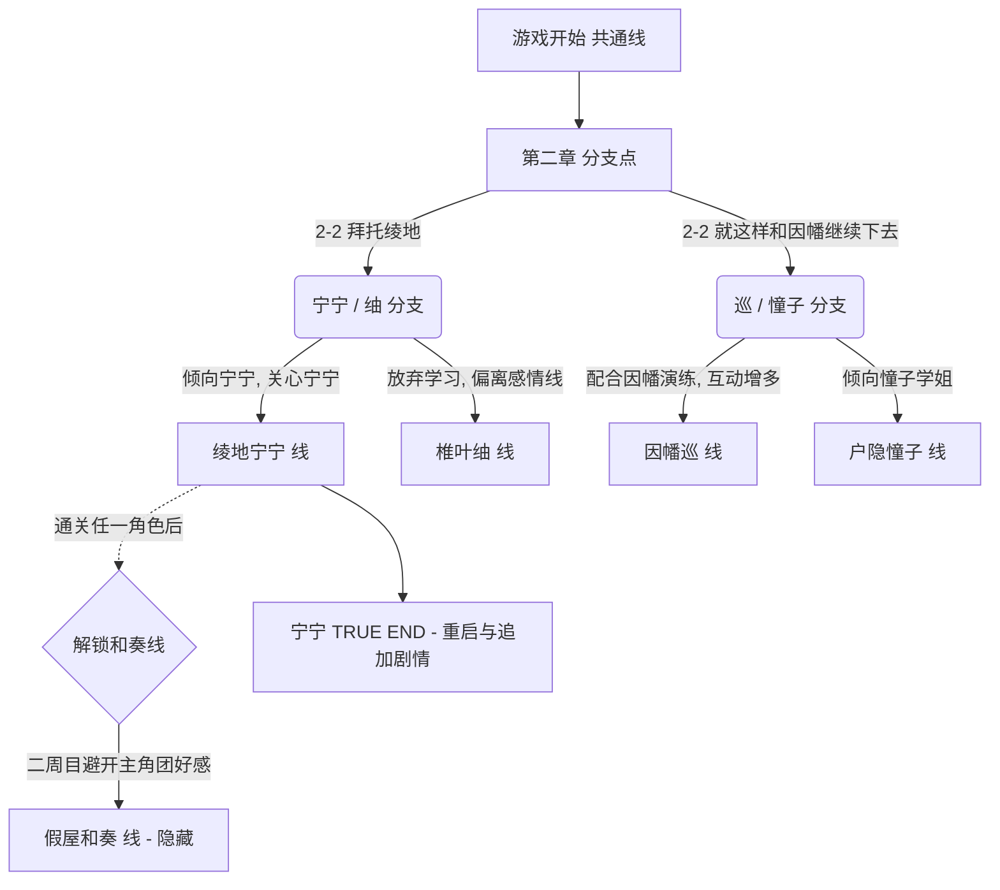
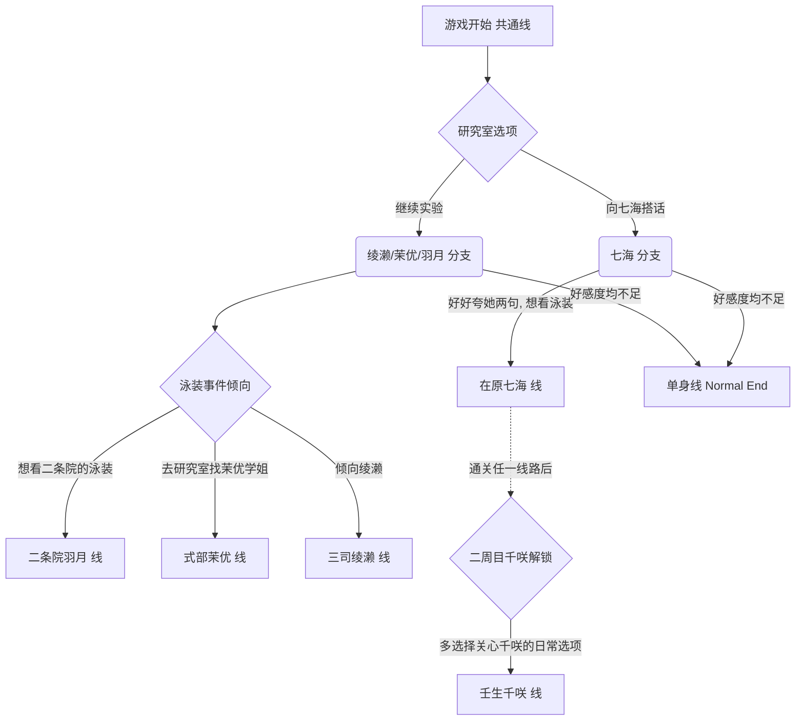
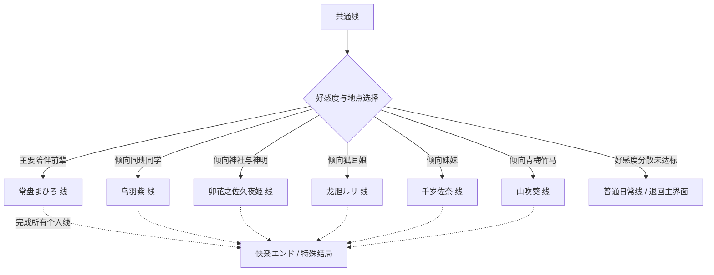

# 柚子社 (Yuzusoft) 经典作品攻略流程图

以下为你整理了《千恋＊万花》、《魔女的夜宴》、《RIDDLE JOKER》以及《天神乱漫》的简要核心路线分支流程图。
这可以帮助你直观地了解各个游戏的女主角进入条件及好感度分支。

````carousel
## 🌸 千恋＊万花 (Senren * Banka)
> [!NOTE]
> 推荐攻略顺序：蕾娜 → 小春 → 芦花 → 芳乃 → 丛雨 → 茉子
> 注意：小春和芦花线通常需要在二周目及以后才能进入。



<!-- slide -->
## 🌙 魔女的夜宴 (Sanoba Witch)
> [!TIP]
> 推荐首先攻略绫地宁宁。隐藏角色【假屋和奏】需在完成任意一周目后解锁。



<!-- slide -->
## 🃏 RIDDLE JOKER
> [!NOTE]
> 推荐攻略顺序：二条院羽月 → 壬生千咲 → 式部茉优 → 在原七海 → 三司绫濑。千咲线需二周目解锁。



<!-- slide -->
## ⛩️ 天神乱漫 (Tenshin Ranman)
> [!TIP]
> 推荐攻略顺序：まひろ → 紫 → 佐久夜 → ルリ → 佐奈 → 葵。全通关后解锁隐藏快乐结局。


````
