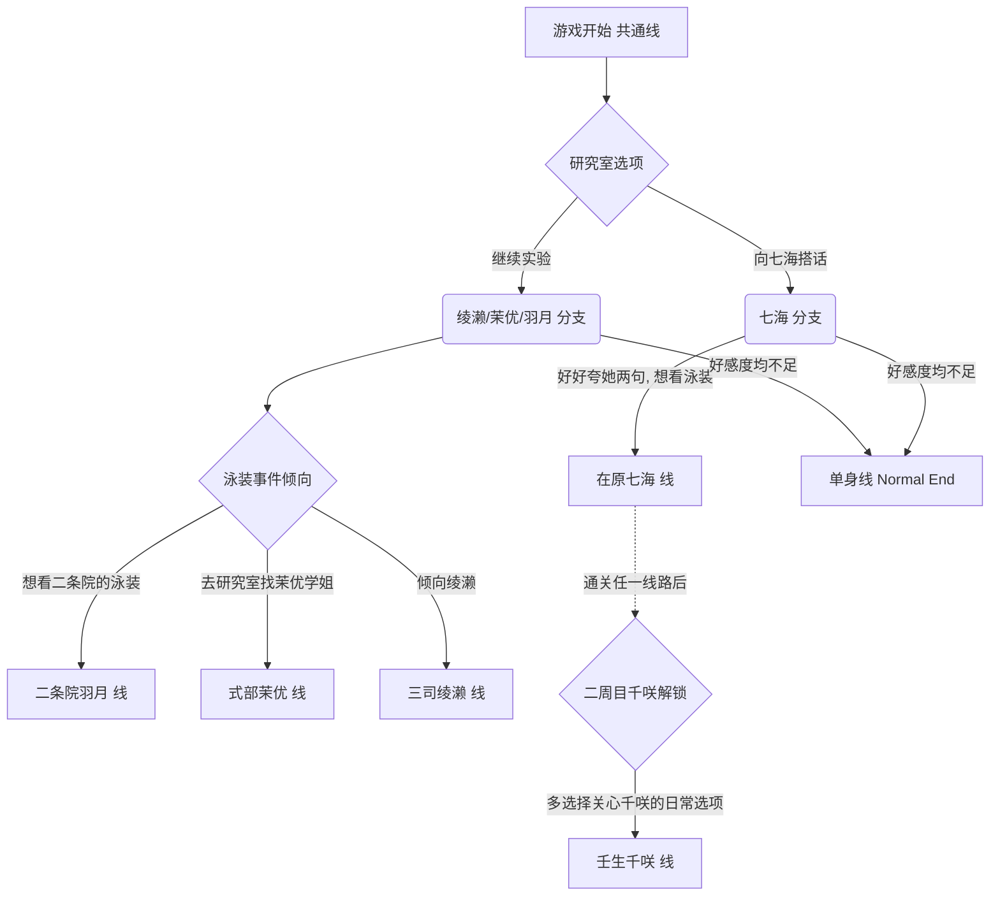

# RIDDLE JOKER 攻略流程图

> [!NOTE]
> 推荐攻略顺序：二条院羽月 → 壬生千咲 → 式部茉优 → 在原七海 → 三司绫濑。千咲线需二周目解锁。

```mermaid
graph TD
    Start[游戏开始 共通线] --> Lab{研究室选项}
    
    Lab -->|继续实验| BranchUpper(绫濑/茉优/羽月 分支)
    Lab -->|向七海搭话| BranchNanami(七海 分支)
    
    BranchUpper --> Swimsuit{泳装事件倾向}
    Swimsuit -->|想看二条院的泳装| RouteHazuki[二条院羽月 线]
    Swimsuit -->|去研究室找茉优学姐| RouteMayu[式部茉优 线]
    Swimsuit -->|倾向绫濑| RouteAyase[三司绫濑 线]
    
    BranchNanami -->|好好夸她两句, 想看泳装| RouteNanami[在原七海 线]
    
    RouteNanami -.通关任一线路后.-> UnlockChisaki{二周目千咲解锁}
    UnlockChisaki -->|多选择关心千咲的日常选项| RouteChisaki[壬生千咲 线]
    
    BranchUpper -->|好感度均不足| BadEnd[单身线 Normal End]
    BranchNanami -->|好感度均不足| BadEnd
```
