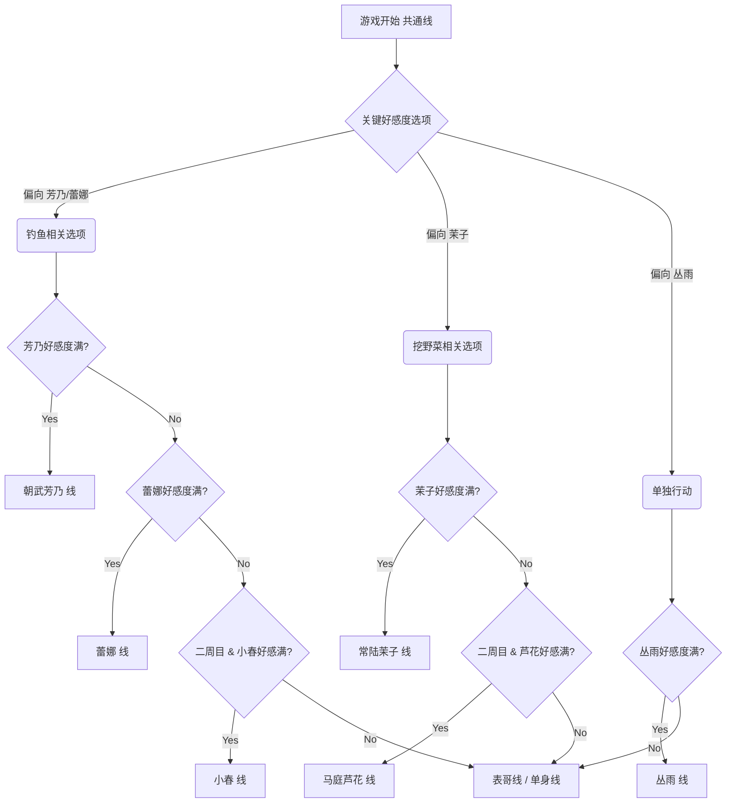

# 千恋＊万花 (Senren * Banka) 攻略流程图

> [!NOTE]
> 推荐攻略顺序：蕾娜 → 小春 → 芦花 → 芳乃 → 丛雨 → 茉子
> 注意：小春和芦花线通常需要在二周目及以后才能进入。

```mermaid
graph TD
    Start[游戏开始 共通线] --> Options1{关键好感度选项}
    
    Options1 -->|偏向 芳乃/蕾娜| Branch1(钓鱼相关选项)
    Options1 -->|偏向 茉子| Branch2(挖野菜相关选项)
    Options1 -->|偏向 丛雨| Branch3(单独行动)
    
    Branch1 --> CheckYoshino{芳乃好感度满?}
    CheckYoshino -->|Yes| RouteYoshino[朝武芳乃 线]
    CheckYoshino -->|No| CheckRena{蕾娜好感度满?}
    CheckRena -->|Yes| RouteRena[蕾娜 线]
    
    Branch2 --> CheckMako{茉子好感度满?}
    CheckMako -->|Yes| RouteMako[常陆茉子 线]
    
    Branch3 --> CheckMurasame{丛雨好感度满?}
    CheckMurasame -->|Yes| RouteMurasame[丛雨 线]
    
    CheckRena -->|No| CheckKoharu{二周目 & 小春好感满?}
    CheckKoharu -->|Yes| RouteKoharu[小春 线]
    
    CheckMako -->|No| CheckRoka{二周目 & 芦花好感满?}
    CheckRoka -->|Yes| RouteRoka[马庭芦花 线]
    
    CheckMurasame -->|No| BadEnd[表哥线 / 单身线]
    CheckKoharu -->|No| BadEnd
    CheckRoka -->|No| BadEnd
```
