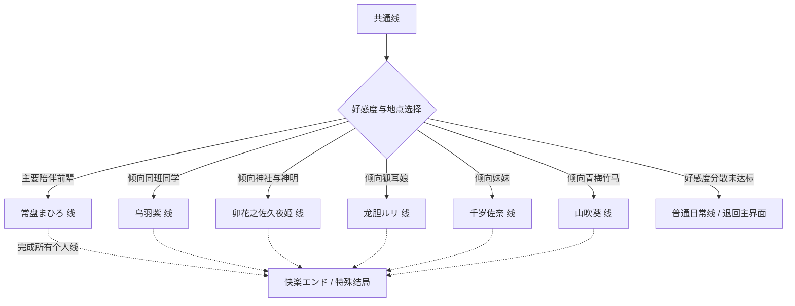

# 天神乱漫 (Tenshin Ranman) 攻略流程图

> [!TIP]
> 推荐攻略顺序：まひろ → 紫 → 佐久夜 → ルリ → 佐奈 → 葵。全通关后解锁隐藏快乐结局。

```mermaid
graph TD
    Start[共通线] --> RouteSelect{好感度与地点选择}
    
    RouteSelect -->|主要陪伴前辈| RouteMahiro[常盘まひろ 线]
    RouteSelect -->|倾向同班同学| RouteYukari[乌羽紫 线]
    RouteSelect -->|倾向神社与神明| RouteSakuya[卯花之佐久夜姫 线]
    RouteSelect -->|倾向狐耳娘| RouteRuri[龙胆ルリ 线]
    RouteSelect -->|倾向妹妹| RouteSana[千岁佐奈 线]
    RouteSelect -->|倾向青梅竹马| RouteAoi[山吹葵 线]
    
    RouteMahiro -.完成所有个人线.-> TrueEnd[快楽エンド / 特殊结局]
    RouteYukari -.-> TrueEnd
    RouteSakuya -.-> TrueEnd
    RouteRuri -.-> TrueEnd
    RouteSana -.-> TrueEnd
    RouteAoi -.-> TrueEnd
    
    RouteSelect -->|好感度分散未达标| BadEnd[普通日常线 / 退回主界面]
```
