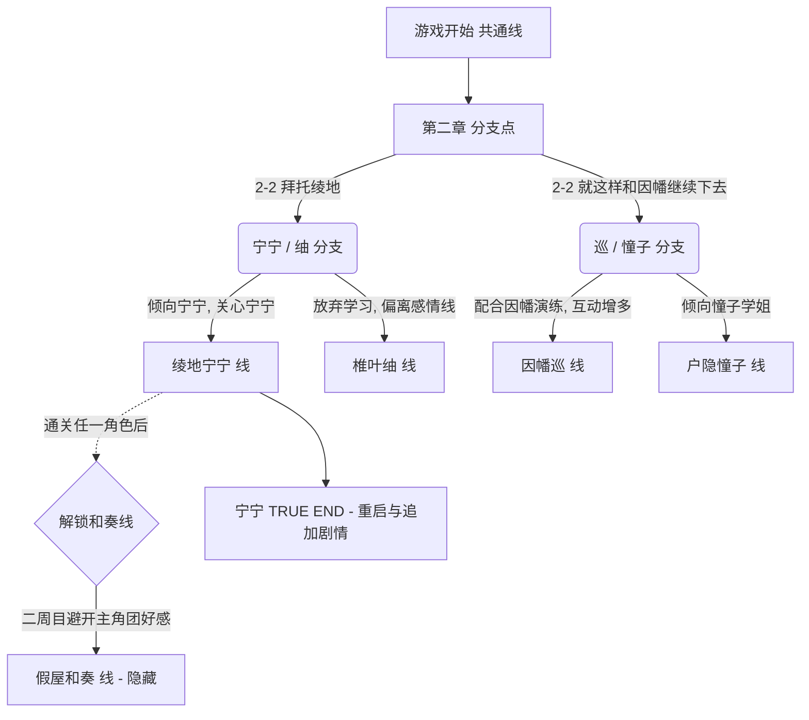

# 魔女的夜宴 (Sanoba Witch) 攻略流程图

> [!TIP]
> 推荐首先攻略绫地宁宁。隐藏角色【假屋和奏】需在完成任意一周目后解锁。

```mermaid
graph TD
    Start[游戏开始 共通线] --> Ch2[第二章 分支点]
    
    Ch2 -->|2-2 拜托绫地| BranchNene(宁宁 / 䌷 分支)
    Ch2 -->|2-2 就这样和因幡继续下去| BranchMeguru(巡 / 憧子 分支)
    
    BranchNene -->|倾向宁宁, 关心宁宁| RouteNene[绫地宁宁 线]
    BranchNene -->|放弃学习, 偏离感情线| RouteTsumugi[椎叶䌷 线]
    
    BranchMeguru -->|配合因幡演练, 互动增多| RouteMeguru[因幡巡 线]
    BranchMeguru -->|倾向憧子学姐| RouteTouko[户隐憧子 线]
    
    RouteNene -.通关任一角色后.-> UnlockWakana{解锁和奏线}
    UnlockWakana -->|二周目避开主角团好感| RouteWakana[假屋和奏 线 - 隐藏]
    
    RouteNene --> TrueEnd[宁宁 TRUE END - 重启与追加剧情]
```
